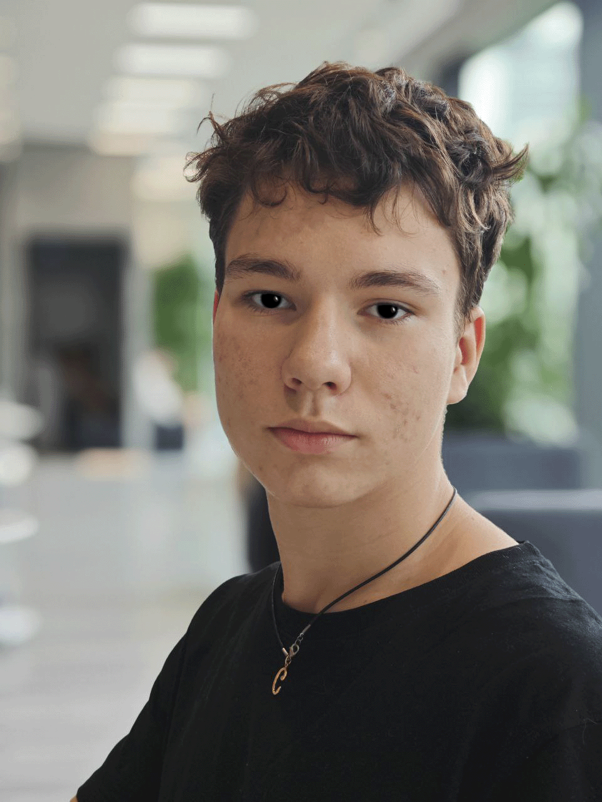

# Резюме Терентьев Артём, **Frontend-разработчик**, 17 лет, *г. Москва*

## Обо мне  
Занимаюсь разработкой более двух лет. Специализируюсь на создании приложений на **React**. В работе придерживаюсь принципов чистого кода и архитектурных стандартов (**FSD**, **SOLID**). Умею работать в команде, быстро осваиваю новые инструменты и не боюсь сложных задач.

## Актуальные навыки
- **Языки:** JavaScript (ES6+), TypeScript, C#, Английский (Intermediate – чтение документации).
- **Frontend:** React, Next.js, Redux Toolkit, React Router v7, React Native.
- **Верстка:** HTML5, CSS/SCSS (БЭМ), TailwindCSS, MUI, Headless UI
- **Backend & Cloud:** Node.js (Express), ASP.NET, Firebase (Auth, Firestore, Hosting).
- **Инфраструктура и инструменты:** Git, Vite, ESLint, Figma.
- **Методологии:** Agile, SOLID, DRY, KISS, OOP.

## Последние пет-проекты
- **Noties** – Сервис для заметок с синхронизацией в реальном времени.
  - *Стек:* React Router v7 Framework, Firebase (Firestore, Auth), Tailwind, Headless UI.
  - *Особенности:* Реализована сложная синхронизация данных и авторизация пользователей.
- **Krestiki-Noliki** – Реализация известной игры по новым правилам.
  - *Стек:* React Router v7 Declarative, CSS modules.
  - *Особенности:* Изменяемые размеры поля, количество и символы игрков, цель, поддержка темной и светлой тем.

## Образование  
- **КС 54, Москва** | Информационные системы и программирование *(2024 – 2027)*
- **Т-Банк** | Интенсив по JavaScript *(Лето 2025)*
- **Yandex&&Young** | Тренировки по алгоритмам *(Весна 2026)*

## Карьера и опыт  
На текущий момент сфокусирован на самообучении, участии в хакатонах и разработке собственных проектов. Ищу стажировку или Junior-позицию в команде, где смогу применить свои знания и расти профессионально.

## Контакты  
- 📱 **Telegram:** [@qe_0p](https://t.me/qe_0p)
- 📞 **Телефон:** +7 (922) 343-35-36  
- 📧 **Email:** [artqmt@gmail.com](mailto:artqmt@gmail.com)  
- 🔗 **GitHub:** [github.com/Arthird](https://github.com/Arthird)